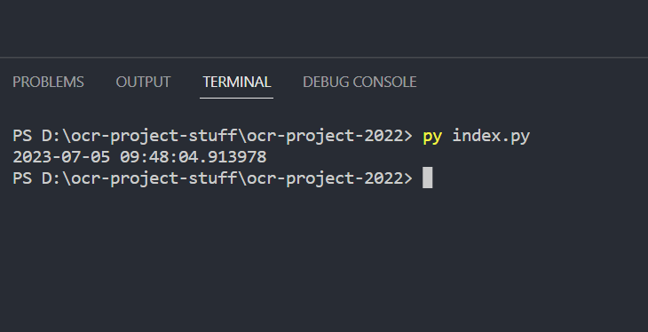

# 1.4a Features of Proposed Solution

## User interface

### Home page

I want to set the tone for the application with this homepage. Therefore, ease of navigation is very important. Users of this application likely have very little experience with using these types algorithms so making the experience as smooth and as simple as possible is important. Different features within in the site must be clearly labelled. A small description of some sort should pop up when hovering over a button. This should inform users what that particular feature will do. The image below shows a very basic concept of what the page could look like.

<figure><figcaption>
Basic homepage concept
</figcaption></figure>

### Graph display

In trading, charts are obviously the most important thing that you use to make an informed decisions on what stocks to buy. Therefore, I would like to stick with the generic red and green which should provide plain and simple information about market activity at a glance. All colours must stand out so placing these charts on a black background will improve visibility and reduce clutter.&#x20;

In addition to this, on the charts, I will also display points at which the algorithm has bought and sold shares. It is important to give the user as much information about the algorithms as possible so the user can step in and take control of the portfolio is necessary. Whilst the system will be mostly AI controlled, some user control features should be implemented for peace of mind reasons.

### Outflow and inflow management

One of the features I would like to add to my website is outflow and inflow management. Basically understanding what money your portfolio is receiving or where money is being lost. This is an incredibly important feature as it should give the user an overview of the return rate of their portfolio. The center piece of this should be a red or green text plus arrow indicating the direction of returns on your portfolio, whether that be positive (green) or negative (red). It should then contain a break down of where that money is going / coming from. For example, which shares you are investing in, money lost from those investments, which investments are gaining you money, how much money remains in your portfolio wallet. Below is an example of some of the information that I could display however some of it is not necessary for this project.

<figure><figcaption>
General idea of some of the information that could be displayed.
</figcaption></figure>

### Manage portfolio

Under this tab, you will have access to your portfolio and have the option to edit which shares are in your portfolio. For simplicity sake I will limit the number of different shares you can invest in to 3. There are resources out there that give access to / simulator market conditions that I will use to update a database which you can search through to help find the right trade for you. In addition to this the there will be a feature to control how much of your wallet can be spent on a particular share. This can be filtered by either, amount of money or number of shares if money is not a problem. This should also encourage risk management which is incredibly important when trading.

### Information page

Trading is obviously not an easy thing to get your head around. Algo-trading as a concept as well can take some explaining to wrap your head around. Therefore, I will be adding an information section to my page which should aid in the understanding of any users. In this section I plan on including any YouTube resources which provide accurate information about the markets and any other informative webpages. Information about algo-trading will be equally valuable as its important for users to understand the process carried out in order to make an automated trade. Basically aiming for a high level of transparency of what my program is doing.

### Market management

The purpose of this page is to ensure the user is up to date on any significant changes in the market. The user should be able to search/filter through all the shares on he market database and see its current performance. I would like to display the name of the stock, the shortened version and its current performance indicated by a percentage coloured either green or red to help those who are visually impaired.

## Limitations

### Limitation 1

Description of a limitation, due to scope/time constraints or difficulty of implementation.
