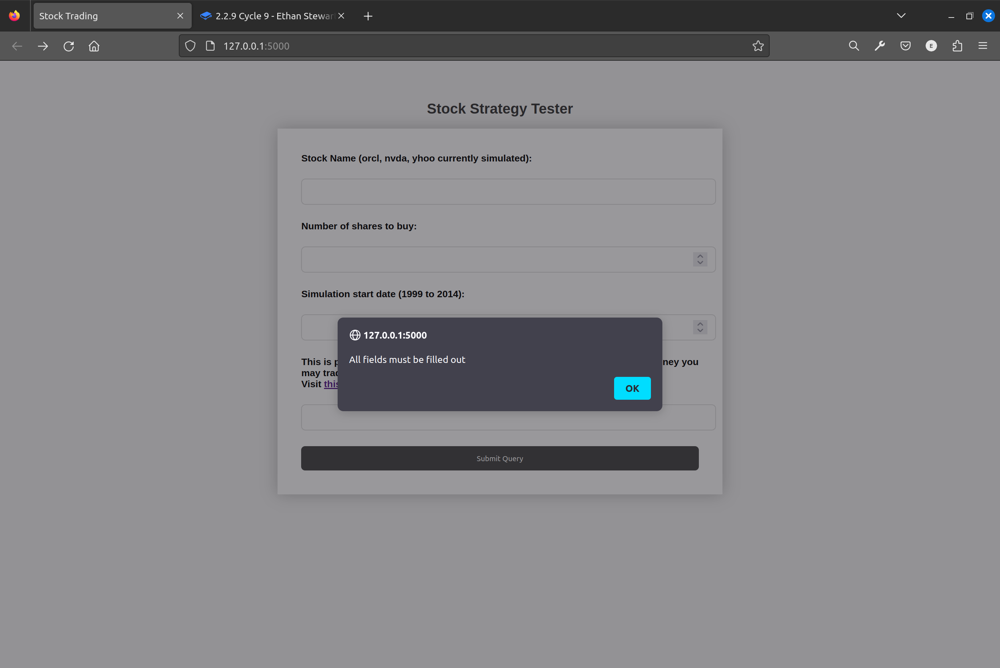

# 2.2.2 Cycle 2

## Design

This cycle is meant to focus on the beginnings of the algorithm I will be using to pick and trade shares. I will use an API called Alpaca API. This will give me access to a paper trading system (not using real life shares). This code needs to be able to fetch my account information from Alpaca.

## Objectives

* [x] Begin foundation of the Alpaca API
* [x] Fetch my account information from Alpaca

## Usability features

This part of the program is not seen by the user. However I have taken steps to ensure that its easier for me to follow the code whilst I'm writing it. To do this I have added ample spacing between each line and comments to remind me of what each part does.

## Key Variables

| Variable Name | Use                                          |
| ------------- | -------------------------------------------- |
| Alpaca        | Stores all the functions from the Alpaca API |
| APIkey        | Store my account API key                     |
| APISecret     | Stores my secret API key                     |

## Pseudocode

```
IMPORT '@alpacahq/alpaca-trade-api' as Alpaca

CONSTANT APIkey = <my api key>
CONSTANT APIsecret = <my secret key>

OBJECT alpaca {
    keyID: APIkey
    secretKey: APIsecret
    paper: true
}

ASYNC FUNCTION printAccount {
    CONSTANT account = getAccount
    CONSOLE LOG account
}

printAccount

```

## Development

### Outcome

In this cycle I successfully managed to retrieve my account information from Alpaca. I did this by using node \<file name> in the terminal

```javascript
//fetching the alpaca API
const Alpaca = require('@alpacahq/alpaca-trade-api')

//keys for project
const APIKey = "PKQU3UMD89C6VSJGZRAV"
const APISecret = "IsaGQPd9bhv4nH5ahSJO4MvSNKPKXiG2RHZpAbyK"

//using object to store necessary data
const alpaca = new Alpaca({
    keyId: APIKey,
    secretKey: APISecret,
    paper: true
  });

//using an asynchronis function to call the data from my alpaca account
async function printAccount() {
    const account = await alpaca.getAccount();
    console.log(account);
}

printAccount();
```

## Challenges

The main challenge I was experiencing was with the type of modules I was importing from Alpaca. The Alpaca API used common JS modules whereas I was inintally using the ES module import. I had to change this to a different format and it then worked. In addition to this understanding the documentation for the API poses its own challenge.

## Testing

### Tests

| Test | Instructions                  | What I expect                                       | What actually happens            | Pass/fail |
| ---- | ----------------------------- | --------------------------------------------------- | -------------------------------- | --------- |
| 1    | Run index.js file in terminal | My account data should be displayed                 | As expected                      | Pass      |
| 2    | Open html file in browser     | Account data should be displayed in browser console | Data is not displayed in console | Fail      |

<figure><figcaption><p>Terminal screenshot</p></figcaption></figure>

<figure><figcaption><p>Screenshot of browser console</p></figcaption></figure>
